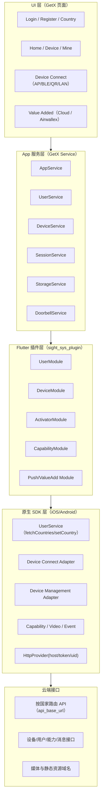
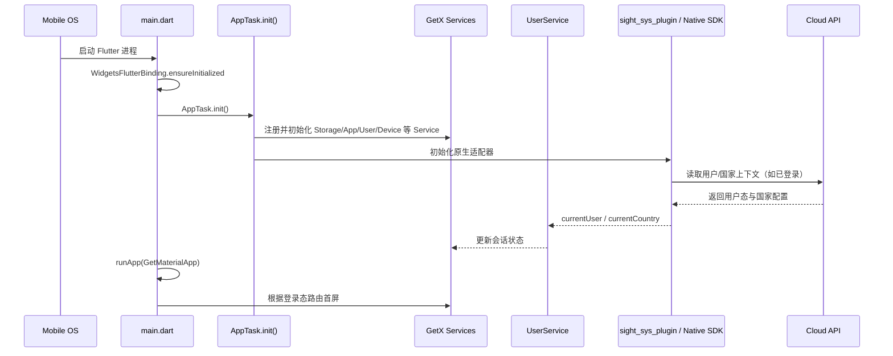
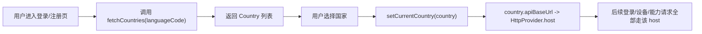

# AnjiaApp 架构与启动流程（重建版）

> 说明：该文档根据此前对 `anjiaapp`（Flutter + GetX + SightSys SDK）分析结果重建，便于本地保存与回溯。

## 1. 总体分层

---

## 2. 启动主流程

---

## 3. 国家与域名路由（关键）

`Country` 核心字段：

- `countryCode`
- `countryName`
- `phonePrefix`
- `registrationMethod`
- `apiBaseUrl`

---

## 4. 模块职责摘要

- **UserService**：登录、注册、国家选择、会话刷新、token 失效处理  
- **DeviceService**：设备列表/详情、产品信息、重命名、房间归属、能力同步  
- **DeviceConnectController**：统一 AP/BLE/QR/LAN/Direct 连接编排  
- **Doorbell/Push**：消息跳转与门铃场景联动  
- **Value Added**：云存储、支付插件（部分模块有独立环境路由）
