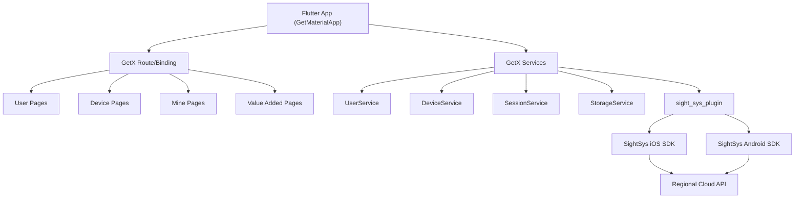
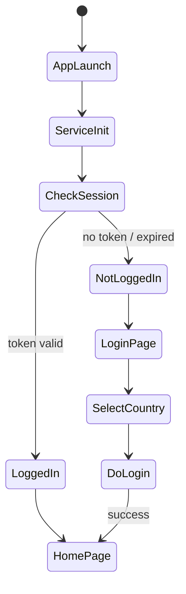
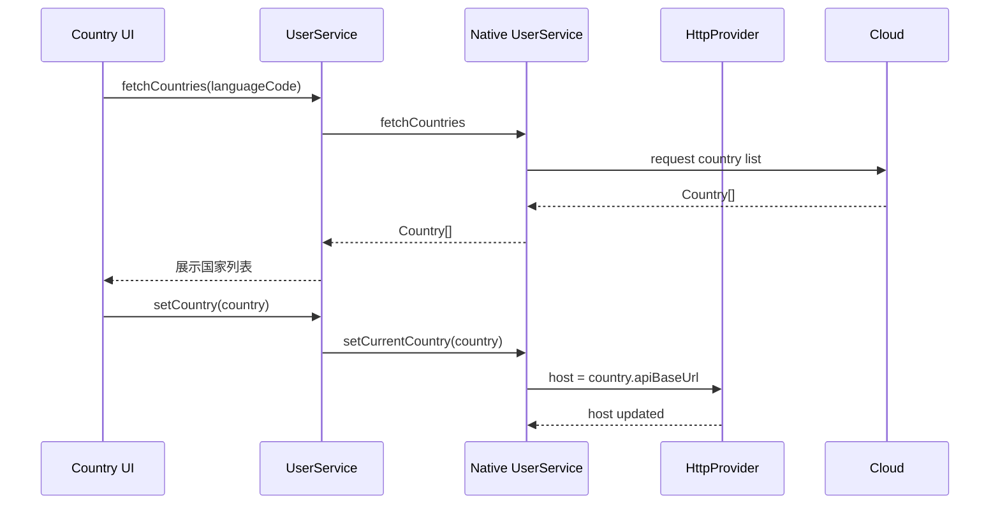
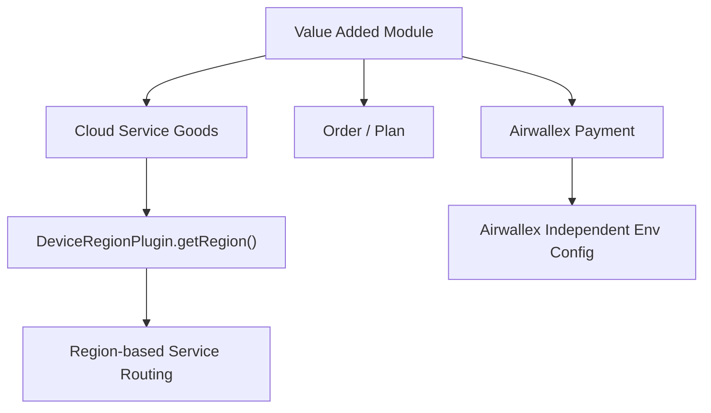

# AnjiaApp 架构汇总图（Mermaid 重建版）

## A. 全局结构图

---

## B. 启动与登录态路由

---

## C. 国家路由与 Host 切换

---

## D. 设备绑定主链路

```mermaid
flowchart LR
    E["Add Device Entry"] --> S["Scan / Manual Select"]
    S --> T["Detect ConnectType"]
    T --> C["DeviceConnectController"]
    C --> A["startActivate()"]
    A --> P["sight_sys_plugin"]
    P --> N["Native Adapter AP/BLE/QR/LAN"]
    N --> R["ActivatorDevice Result"]
    R --> NM["Set Device Name"]
    NM --> RM["Set Room"]
    RM --> L["Device List Refresh"]
```

---

## E. Value Added 与独立路由提示

> 说明：Value Added 某些模块有独立环境配置，可能不完全跟随主业务 `apiBaseUrl`。
