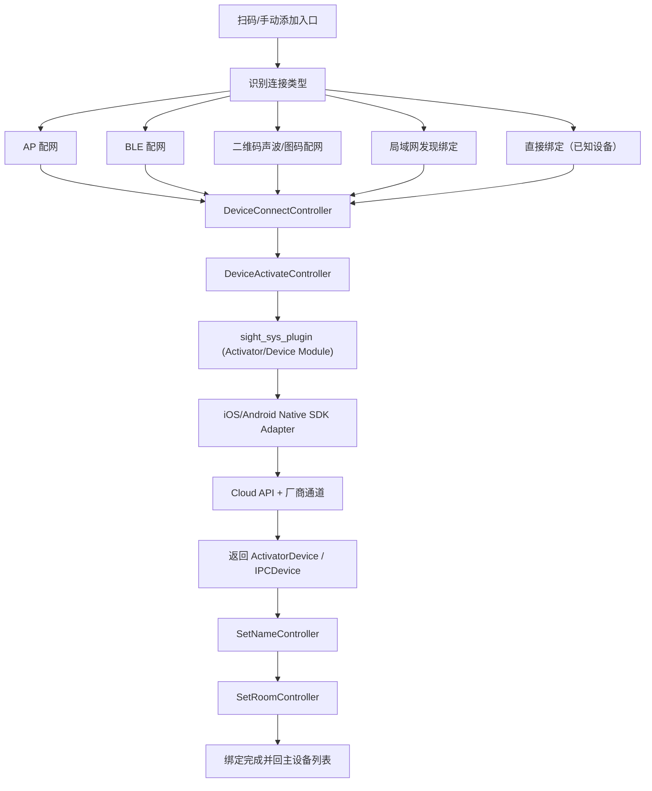
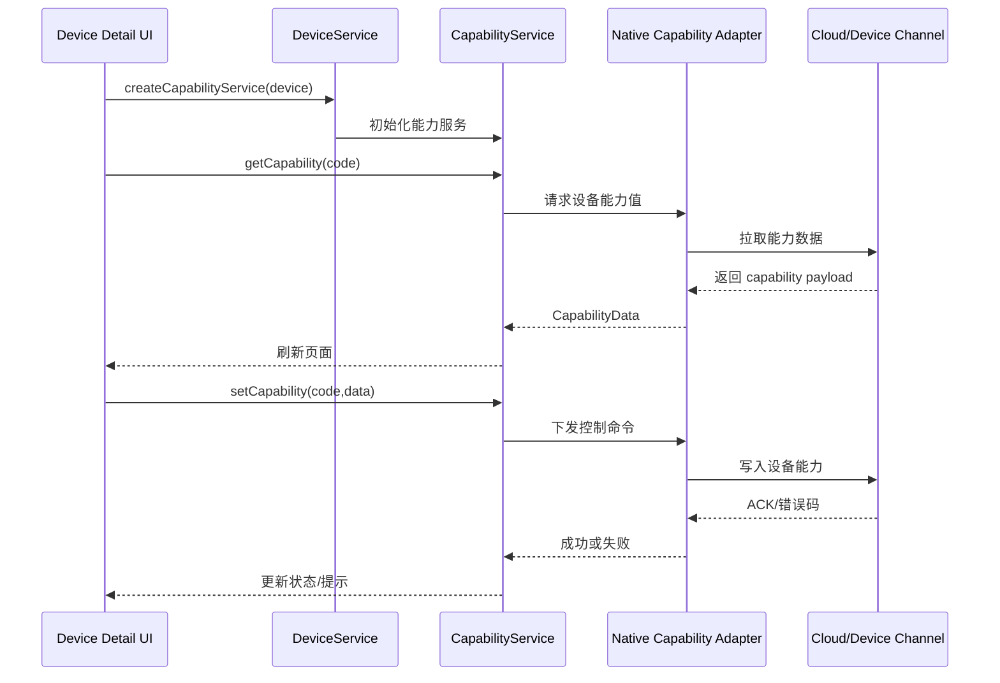

# Device 模块架构图（重建版）

## 1. 设备绑定总览

---

## 2. 控制器与职责

### DeviceConnectController
- 作为连接流程工厂，按 `DeviceConnectType` 创建对应 `DeviceConnector`
- 统一 `startActivate()/stopActivate()/toNextStep()`

### DeviceActivateController
- 管理激活倒计时与异常处理
- 连接成功后导航到设备命名与房间设置

### SetNameController / SetRoomController
- 分别调用 `DeviceService.renameDevice()` 与 `DeviceService.updateDevice()`
- 将设备信息补全为可展示状态

---

## 3. 设备能力同步流程

---

## 4. 关键风险点（用于后续排查）

- 国家路由未正确设置时，设备绑定会命中错误地域后端
- AP/BLE 依赖原生权限和系统网络状态，错误多在原生层抛出
- 低功耗设备能力读取延迟高，需要先唤醒再同步能力
